# Blogging Platform RESTful API

A robust, modular, and self-contained **Blog API** built with **Node.js** and **Express.js**. This backend provides complete RESTful endpoints for user registration, JWT authentication, blog posts CRUD, commenting threads, schema validation, colorized HTTP logging, and centralized error recovery.

---

## Table of Contents
1. [Project Overview](#project-overview)
2. [Architecture & Design](#architecture--design)
3. [Core Node.js Concepts Explained](#core-nodejs-concepts-explained)
4. [Setup & Installation Instructions](#setup--installation-instructions)
5. [API Documentation (Endpoint Specs)](#api-documentation-endpoint-specs)
6. [Interactive Documentation (Swagger UI)](#interactive-documentation-swagger-ui)
7. [Automated Testing & Evidence](#automated-testing--evidence)
8. [Codebase Structure](#codebase-structure)

---

## Project Overview

This project implements a fully functional blogging platform API designed with production-grade engineering principles:
*   **Decoupled Controller-Route Architecture**: Clear division of concerns.
*   **JSON-Based Database Engine**: Lightweight local persistence that maintains posts, comments, and users across server reboots.
*   **JWT Security Guards**: Standard JSON Web Tokens for session-based auth and route protection.
*   **Access Privilege Verification**: Only authors can modify their posts. Comments are moderated—deleted only by the comment writer or the parent blog post owner.
*   **Validator Schema Middleware**: Blocks invalid payloads immediately at the route level with descriptive validation error arrays.
*   **Centralized Error Interceptor**: Express middleware formatting operational errors and masking server trace details in production.

---

## Architecture & Design

Below is a system communication diagram showing the flow of a request through our middleware stack:

```mermaid
sequenceDiagram
    autonumber
    actor Client
    participant Router as Express Router
    participant Logger as Custom Logger
    participant Validator as Validator Schema
    participant Auth as Auth Guard (JWT)
    participant Controller as Resource Controller
    participant DB as JSON DB File
    participant Err as Error Handler

    Client->>Logger: Send HTTP Request
    activate Logger
    Note over Logger: Records timestamp & details
    Logger->>Router: Forward Request
    activate Router
    
    rect rgb(30, 41, 59)
        Note over Router: Check routes & match schemas
        Router->>Validator: Validate Schema (if any)
        alt Validation Fails
            Validator-->>Err: next(AppError 400)
            Err-->>Client: 400 Bad Request JSON
        end
    end
    
    rect rgb(17, 24, 39)
        Note over Router: Secured endpoint check
        Router->>Auth: Verify JWT Token (if auth required)
        alt Invalid Token / Missing Header
            Auth-->>Err: next(AppError 401)
            Err-->>Client: 401 Unauthorized JSON
        end
    end

    Router->>Controller: Route to controller action
    activate Controller
    Controller->>DB: Perform DB Read/Write
    DB-->>Controller: Return Database Model
    
    alt Error Occurs inside controller
        Controller-->>Err: next(Error)
        Err-->>Client: Formatted JSON response
    else Operation Successful
        Controller-->>Client: 200/201 JSON Payload
    end
    
    deactivate Controller
    deactivate Router
    res->>Logger: Request lifecycle finish event
    Note over Logger: Prints colorized log to console & saves plain text log line
    deactivate Logger
```



---

## Core Node.js Concepts Explained

### 1. Introduction to Node.js & Server-Side JavaScript
Historically, JavaScript was locked to browsers, executing in a sandboxed runtime to manipulate HTML DOM elements. Node.js broke this barrier by compiling Google's V8 engine into a standalone C++ runtime. 
*   **Server-Side Capabilities**: Node.js equips JavaScript with low-level interfaces for OS interactions: file system read/writes, TCP sockets, HTTP networking, and process management.
*   **V8 Engine Compilation**: JavaScript source code is dynamically compiled into native machine code rather than being interpreted step-by-step, facilitating quick computations.

### 2. Event-Driven & Non-Blocking Architecture
Unlike thread-per-request architectures (like Apache/PHP) which create a new OS thread for each client connection—blocking resources while waiting for operations like database reads—Node.js operates on a **Single-Threaded Event Loop** model.

*   **The Non-Blocking I/O Principle**: When Node.js performs a system operations (e.g., querying the filesystem or database), it delegates the task to the underlying operating system kernel or the internal C++ thread pool (Libuv). Instead of waiting idly, the execution thread moves on to handle other incoming requests.
*   **Callback Queues & the Loop**: Once an I/O operation finishes, a notification is sent to the Event Loop, placing the completion callback in the appropriate execution queue. When the JavaScript call stack becomes empty, the Event Loop processes the waiting callbacks sequentially.

```
Incoming Request ──▶ Express Router ──▶ [JS Call Stack]
                                              │ (Delegate I/O)
                                              ▼
                                        [Libuv Thread Pool / OS Kernel] (File DB writes)
                                              │ (On Complete)
                                              ▼
                                       [Callback Queue] ──▶ (Event Loop pulls back to stack)
```

### 3. RESTful API Design
Representational State Transfer (REST) is an architectural style mapping client operations to server entities using standard HTTP specifications:
*   **Nouns as Resources**: URIs designate resources, e.g. `/api/posts` or `/api/posts/:postId/comments`.
*   **HTTP Methods (Verbs)**:
    *   `GET`: Read resource details (Safe & Idempotent).
    *   `POST`: Instantiate a new resource (Not Idempotent).
    *   `PUT`: Replace/Update an entire resource, or create it if not found (Idempotent).
    *   `DELETE`: Destroy a resource (Idempotent).
*   **Status Codes**:
    *   `200 OK`: Successful read/update operations.
    *   `201 Created`: Successful creation operations.
    *   `400 Bad Request`: Payload validation failures.
    *   `401 Unauthorized`: Invalid or missing authentication tokens.
    *   `403 Forbidden`: Authenticated user lacks access permissions.
    *   `404 Not Found`: Target resource does not exist.
    *   `409 Conflict`: Unique constraint conflicts (like duplicate emails).
    *   `500 Internal Server Error`: Uncaught exceptions or server bugs.

### 4. Middleware Implementation
Middlewares are functions that sit in the request-response lifecycle. Each middleware receives the `req` (request) object, the `res` (response) object, and a `next` callback function.
```javascript
function sampleMiddleware(req, res, next) {
  // 1. Inspect or modify request properties (e.g. parse header, check session)
  // 2. Terminate response OR trigger next() to pass execution down the line
  next(); 
}
```
If a middleware does not call `next()` or send a response back, the client request will hang indefinitely. Our application utilizes:
1.  **Application-Level**: `cors()`, `express.json()`, `express.urlencoded()` parsing data.
2.  **Custom Loggers**: `requestLogger` wrapping responses.
3.  **Guards**: `authenticateJWT` evaluating headers.
4.  **Schema Validators**: `validateSchema(schemas.post)` filtering bodies.
5.  **Global Handlers**: `errorHandler` capturing throw calls.

---

## Setup & Installation Instructions

Ensure you have [Node.js](https://nodejs.org/) installed (v18 or higher is recommended).

### 1. Clone & Extract Project Files
Verify all files are structured in your working directory.

### 2. Configure Environment Variables
A `.env` file contains runtime secrets. Create a `.env` in the root folder based on `.env.example`:
```env
PORT=3000
JWT_SECRET=super_secret_blog_api_key_2026_antigravity
NODE_ENV=development
```

### 3. Install Dependencies
Run the package installation script:
```bash
npm install
```

### 4. Run Development Server
Boot the server with hot-reloading (using nodemon):
```bash
npm run dev
```
You should see:
```text
🚀 Blog API server listening on port: 3000
🌍 Interactive API docs: http://localhost:3000/api-docs
```

### 5. Run Verification Tests
Verify API features using our native HTTP test suite:
```bash
npm test
```

---

## API Documentation (Endpoint Specs)

### Authentication

#### 1. Register User
*   **Path**: `POST /api/auth/register`
*   **Access**: Public
*   **Request Body**:
    ```json
    {
      "username": "jane_doe",
      "email": "jane@example.com",
      "password": "securepassword123"
    }
    ```
*   **Success Response (201 Created)**:
    ```json
    {
      "status": "success",
      "message": "User registered successfully.",
      "data": {
        "user": {
          "id": "u_1700000000000",
          "username": "jane_doe",
          "email": "jane@example.com",
          "createdAt": "2026-08-07T10:00:00.000Z"
        }
      }
    }
    ```

#### 2. Login User
*   **Path**: `POST /api/auth/login`
*   **Access**: Public
*   **Request Body**:
    ```json
    {
      "email": "jane@example.com",
      "password": "securepassword123"
    }
    ```
*   **Success Response (200 OK)**:
    ```json
    {
      "status": "success",
      "message": "Login successful.",
      "data": {
        "token": "eyJhbGciOiJIUzI1NiIsInR5cCI6IkpXVCJ9...",
        "user": {
          "id": "u_1700000000000",
          "username": "jane_doe",
          "email": "jane@example.com",
          "createdAt": "2026-08-07T10:00:00.000Z"
        }
      }
    }
    ```

#### 3. Get Current User Profile (Me)
*   **Path**: `GET /api/auth/me`
*   **Access**: Private (Requires Bearer token)
*   **Headers**: `Authorization: Bearer <your_jwt_token>`
*   **Success Response (200 OK)**:
    ```json
    {
      "status": "success",
      "data": {
        "user": {
          "id": "u_1700000000000",
          "username": "jane_doe",
          "email": "jane@example.com",
          "createdAt": "2026-08-07T10:00:00.000Z"
        }
      }
    }
    ```

---

### Blog Posts

#### 1. Retrieve All Posts
*   **Path**: `GET /api/posts`
*   **Access**: Public
*   **Query Parameters**:
    *   `search` (string): Filters title or content matches.
    *   `authorId` (string): Filters posts created by a specific user.
*   **Success Response (200 OK)**:
    ```json
    {
      "status": "success",
      "results": 1,
      "data": {
        "posts": [
          {
            "id": "p_1786080345678",
            "title": "Mastering Node.js and Express",
            "content": "Building RESTful APIs with Express is incredibly simple, clean...",
            "tags": ["nodejs", "express"],
            "authorId": "u_1700000000000",
            "createdAt": "2026-08-07T10:00:00.000Z",
            "updatedAt": "2026-08-07T10:00:00.000Z",
            "author": {
              "id": "u_1700000000000",
              "username": "jane_doe"
            }
          }
        ]
      }
    }
    ```

#### 2. Create Blog Post
*   **Path**: `POST /api/posts`
*   **Access**: Private (Requires Bearer token)
*   **Request Body**:
    ```json
    {
      "title": "Mastering Node.js and Express",
      "content": "Building RESTful APIs with Express is incredibly simple, clean, and highly performant.",
      "tags": ["nodejs", "express", "javascript"]
    }
    ```
*   **Success Response (201 Created)**:
    ```json
    {
      "status": "success",
      "message": "Blog post created successfully.",
      "data": {
        "post": {
          "id": "p_1786080345678",
          "title": "Mastering Node.js and Express",
          "content": "Building RESTful APIs with Express is incredibly simple, clean...",
          "tags": ["nodejs", "express", "javascript"],
          "authorId": "u_1700000000000",
          "createdAt": "2026-08-07T10:00:00.000Z",
          "updatedAt": "2026-08-07T10:00:00.000Z",
          "author": {
            "id": "u_1700000000000",
            "username": "jane_doe"
          }
        }
      }
    }
    ```

#### 3. Get Post by ID
*   **Path**: `GET /api/posts/:id`
*   **Access**: Public
*   **Success Response (200 OK - Includes Hydrated Comments and Authors)**:
    ```json
    {
      "status": "success",
      "data": {
        "post": {
          "id": "p_1786080345678",
          "title": "Mastering Node.js and Express",
          "content": "Building RESTful APIs with Express is...",
          "tags": ["nodejs", "express"],
          "authorId": "u_1700000000000",
          "createdAt": "2026-08-07T10:00:00.000Z",
          "updatedAt": "2026-08-07T10:00:00.000Z",
          "author": {
            "id": "u_1700000000000",
            "username": "jane_doe"
          },
          "comments": [
            {
              "id": "c_1786080444555",
              "postId": "p_1786080345678",
              "authorId": "u_9999999999999",
              "content": "Great post! Extremely helpful.",
              "createdAt": "2026-08-07T10:05:00.000Z",
              "author": {
                "id": "u_9999999999999",
                "username": "commenter_sam"
              }
            }
          ]
        }
      }
    }
    ```

#### 4. Update Blog Post
*   **Path**: `PUT /api/posts/:id`
*   **Access**: Private (Only post creator)
*   **Request Body**:
    ```json
    {
      "title": "Mastering Node.js and Express v2",
      "content": "Updated content explaining middleware chaining structures..."
    }
    ```

#### 5. Delete Blog Post
*   **Path**: `DELETE /api/posts/:id`
*   **Access**: Private (Only post creator)
*   **Success Response (200 OK)**:
    ```json
    {
      "status": "success",
      "message": "Blog post and associated comments deleted successfully."
    }
    ```

---

### Comments Section

#### 1. Add Comment to Post
*   **Path**: `POST /api/posts/:postId/comments`
*   **Access**: Private (Requires Bearer token)
*   **Request Body**:
    ```json
    {
      "content": "Insightful breakdown of non-blocking I/O!"
    }
    ```

#### 2. Get Comments for Post
*   **Path**: `GET /api/posts/:postId/comments`
*   **Access**: Public

#### 3. Delete Comment
*   **Path**: `DELETE /api/posts/:postId/comments/:commentId`
*   **Access**: Private (Only comment creator **OR** the blog post author as a moderator)
*   **Success Response (200 OK)**:
    ```json
    {
      "status": "success",
      "message": "Comment deleted successfully."
    }
    ```

---

## Interactive Documentation (Swagger UI)

A dynamic Swagger UI is integrated and served directly by the server. 
1. Run the server using `npm run dev`.
2. Open your web browser and navigate to: **`http://localhost:3000/api-docs`**.
3. You will see an interactive web application styling all endpoint contracts. You can input tokens and trigger requests directly from the UI.

---

## Automated Testing & Evidence

We include a test runner to guarantee API correctness. Below is the logs copy of our local verification run:

```text
🧪 RUNNING NODE.JS BLOG API VERIFICATION SUITE
====================================================

▶ Test 1: GET /api/health ...
----------------------------------------------------
🚀 Blog API server listening on port: 3050
🌍 Interactive API docs: http://localhost:3050/api-docs
----------------------------------------------------
[2026-08-07T05:17:22.191Z] GET    /api/health 200 - 6ms
  ✔ Passed
▶ Test 2: POST /api/auth/register (Validation check) ...
[2026-08-07T05:17:22.217Z] POST   /api/auth/register 400 - 1ms
  ✔ Passed (Correctly rejected malformed payload)
▶ Test 3: POST /api/auth/register (Success check) ...
[2026-08-07T05:17:22.225Z] POST   /api/auth/register 201 - 146ms
  ✔ Passed
▶ Test 4: POST /api/auth/register (Duplicate check) ...
[2026-08-07T05:17:22.374Z] POST   /api/auth/register 409 - 1ms
  ✔ Passed (Correctly blocked duplicate email)
▶ Test 5: POST /api/auth/login (Failure check) ...
[2026-08-07T05:17:22.379Z] POST   /api/auth/login 401 - 127ms
  ✔ Passed (Correctly rejected invalid credentials)
▶ Test 6: POST /api/auth/login (Success check) ...
[2026-08-07T05:17:22.509Z] POST   /api/auth/login 200 - 126ms
  ✔ Passed (Captured access token)
▶ Test 7: GET /api/auth/me (Protected check) ...
[2026-08-07T05:17:22.637Z] GET    /api/auth/me 200 - 2ms
  ✔ Passed
▶ Test 8: POST /api/posts (No token failure) ...
[2026-08-07T05:17:22.642Z] POST   /api/posts 401 - 0ms
  ✔ Passed (Correctly rejected unauthorized post creation)
▶ Test 9: POST /api/posts (Success check) ...
[2026-08-07T05:17:22.644Z] POST   /api/posts 201 - 4ms
  ✔ Passed
▶ Test 10: GET /api/posts (Listing & filter checks) ...
[2026-08-07T05:17:22.650Z] GET    /api/posts 200 - 1ms
[2026-08-07T05:17:22.656Z] GET    /api/posts?search=Express 200 - 1ms
[2026-08-07T05:17:22.659Z] GET    /api/posts?search=Python 200 - 0ms
  ✔ Passed
▶ Test 11: POST /api/posts/:id/comments ...
[2026-08-07T05:17:22.661Z] POST   /api/posts/p_1786079842646oago/comments 201 - 4ms
  ✔ Passed
▶ Test 12: GET /api/posts/:id (Hydrated entity details) ...
[2026-08-07T05:17:22.666Z] GET    /api/posts/p_1786079842646oago 200 - 1ms
  ✔ Passed
▶ Test 13: PUT /api/posts/:id ...
[2026-08-07T05:17:22.669Z] PUT    /api/posts/p_1786079842646oago 200 - 3ms
  ✔ Passed
▶ Test 14: DELETE endpoints ...
[2026-08-07T05:17:22.673Z] DELETE /api/posts/p_1786079842646oago/comments/c_1786079842663juqu 200 - 3ms
[2026-08-07T05:17:22.677Z] GET    /api/posts/p_1786079842646oago 200 - 1ms
[2026-08-07T05:17:22.680Z] DELETE /api/posts/p_1786079842646oago 200 - 2ms
[2026-08-07T05:17:22.684Z] GET    /api/posts/p_1786079842646oago 404 - 0ms
  ✔ Passed

🎉 ALL SYSTEM VERIFICATION TESTS PASSED SUCCESSFULLY!

🧹 Cleaning up test database environment...
  ✔ Deleted data/db.test.json
🔌 Shutting down test server...
```

---

## Codebase Structure

The project has the following modular directory layout:

```text
├── .env                  # Environment secrets configuration (Port, JWT Secret)
├── .env.example          # Sample environment template
├── package.json          # Dependencies & execution script triggers
├── server.js             # Express core initialization and route boots
│
├── data/
│   └── db.json           # Active JSON database storage file
│
├── logs/
│   └── access.log        # Plaintext request logging history
│
└── src/
    ├── controllers/
    │   ├── authController.js     # User register, login & profile lookup
    │   ├── postController.js     # Post CRUD management & relationships
    │   └── commentController.js  # Posting comments & access permission logic
    │
    ├── docs/
    │   └── swaggerDef.js         # Static OpenAPI / Swagger schema definition
    │
    ├── middleware/
    │   ├── auth.js               # JWT security verification guard
    │   ├── errorHandler.js       # AppError parser & Express central logger
    │   ├── logger.js             # Custom colored console log engine
    │   └── validator.js          # Field-level validation schema validator
    │
    ├── models/
    │   └── db.js                 # JSON file persistent database adapter
    │
    ├── routes/
    │   ├── authRoutes.js         # Map auth actions
    │   ├── postRoutes.js         # Map posts CRUD (nested comments here)
    │   └── commentRoutes.js      # Sub-nested comments routing definitions
    │
    ├── test/
    │   └── verify.js             # Native automated integration tests suite
    │
    └── utils/
        └── asyncHandler.js       # Express asynchronous controller wrapper
```
# task-9-completed
